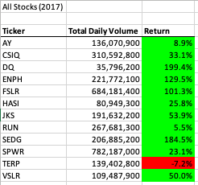
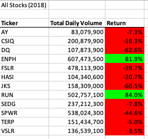
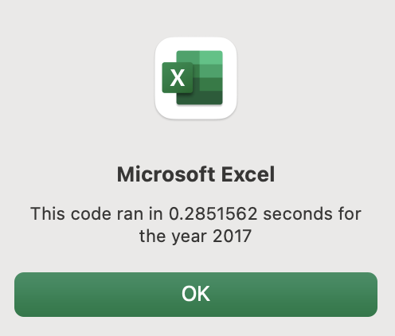
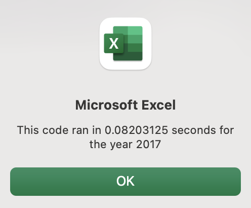
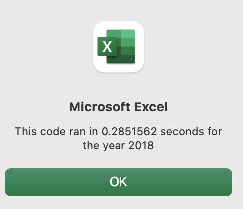
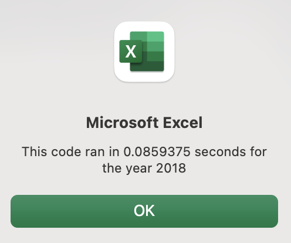

# Analysis of Green Stocks in 2017 and 2018 with Refactored Code 
---
## The purpose of this project is analyze of the performance of a portfolio of green stocks in 2017 and 2018, informing our freind Steven of the best green stocks for his parents to invest in. Upon the completion of our analysis, we will refactor our VBA code to enable the script to run faster and run on potentially larger data sets. This project will also examine our success in refactoring the code to run faster. 
### Steven's parents believe that frequently traded stocks are priced at their true value, so we looped through all our data to find not only the performance on the stocks in both years, but also their trading volume. To create a visual that is easy for Steven to understand, we color formatted the performance of each stock. The results of this process are displayed below. 

### As the images above demonstrate, the stocks performed better overall in 2017 than they did in 2018. Only two stocks, tickers "ENPH" and "RUN," had a positive returns in both year. After conducting our inital analysis, we refactored our code to help the script run faster and create a framework that Steven could use to analyze larger data sets with more stocks. Our refactoring was successfull, and the images below show a 348% increase in run time speed for the 2017 stocks, and a 332% increase in run time speeds for the 2018 stocks. 

### Overall, the refactoring of our code resulted in a more flexible and faster script. Steven can now add stocks to his data and obtain the same analysis as was peformed on the above tickers. However, refactoring the code did result in new errors and took longer to create than the original code. Further, if Steven decides he want to update our VBA code himself, he will have a harder time understanding the refactored code. Despite these drawbacks, the refactored code is a better overall script and our project was a success. 
